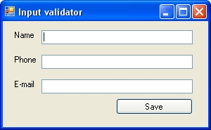

# Assignment: Regular expression

### Exercise 1: Input validation

Using Visual Studio, create a new WPF application project, and create a basic form, which prompts the user his/her name, e-mail address and phone number:



After clicking the save button, evaluate the input if the phone number and e-mail address are valid. Since this is not a WinForms-oriented course you can perform this validation simply in the event handler of the save button.

#### Hint

For the corresponding Regex expressions use the examples in the presentation (find the link at the beginning of the page).

#### Step by step

1.  Name the controls properly, for example: **txtName**, **txtPhone**, **txtEmail**, **btnSave**

2.  Add reference to the proper namespace for using the regular expressions:

3.  Double click the button to create the event handler automatically. Wrie a method which checks that the given input doesn't match with the regular expression. If so then open a MessageBox with a warining message. Do this validation on all the input fields.

4.  Come up with examples that are rejected and ones which are accepted for each field.

    -   Factor out each validator to its own function

        For example:

        ```csharp
        if (!Regex.IsMatch(txtName.Text, @"^([A-Za-z]+\s*)+$"))
        MessageBox.Show("The name is invalid (only alphabetical characters are allowed)");

        // shall become

        if (!ValidName(txtName.Text))
            MessageBox.Show("The name is invalid (only alphabetical characters are allowed)");
        ```

5.  Try to break up the expressions.

    For example:

    ```csharp
    string name = "[a-zA-Z]+";
    string whitespace = @"\s";
    string pattern = "^(" + name + whitespace "*)+$";
    // ...
    ```

6.  **Write unit tests** for the validator functions

    (They should return a bool and take a string as an argument)

### Exercise 2: Reformat a String

In this exercise, you must reformat phone numbers into a standard (###) ###-#### format. You can implement it by extending the previous WinForms application. As an input, you expect a string which matches the following Regex pattern:

```csharp
_^\(?(\d{3})\)?[\s\-]?(\d{3})\-?(\d{4})$_
```

You should extract the matching groups from the input and reorganize them for the output format.

#### Step by step

1.  Add a method named _ReformatPhone_ that returns a string and accepts a single string as an argument. Reformat the data into the (###) ###-#### format.

    Notice that each of the \d{n} expressions is surrounded by parentheses. This places each of the sets of numbers into a separate group that can be easily referenced inside **String.Format**.

2.  Change the **btnSave** event handler method so that it writes **ReformatPhone(s)** into the **txtPhone** field:

    Of course you should execute this line only after the validation!