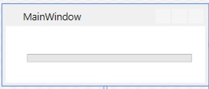

# Respond to an event

## Task

In this exercise we will create a class that responds to a timer event.

## Step by step

1. Using Visual Studio, create a new _WPF App (.NET Framework)_ application project. Name the project _TimerEvents_.

2. Add a _ProgressBar_ control to the form, as shown below.

    

    Click on the ProgressBar and hit F4. Set the Name of the control in the properties window to _e.g.: myProgressBar_.

3. Within the Window code-behind file _(MainWindow.xaml.cs)_, declare an instance of a System.Windows.Threading.DispatcherTimer object. DispatcherTimer objects can be used to throw events after a specified number of milliseconds. The following code sample shows how to declare a Timer object:

    ```csharp
    private DispatcherTimer _timer;
    ```

4. In the designer, view the properties for the window. Then view the list of events. Double-click the Loaded event to automatically create an event handler that will run the first time the window is initialized. Within the method, initialize the DispatcherTimer object, set the interval to one second, create an event handler for the Tick event, and start the timer. The following code sample demonstrates this:

    ```csharp
    private void Window_Loaded(object sender, RoutedEventArgs e)
    {
        _timer = new DispatcherTimer();
        _timer.Interval = new TimeSpan(0, 0, 1);
        _timer.Tick += new EventHandler(dispatcherTimer_Tick);
        _timer.Start();
    }
    ```

5. Implement the method that will respond to the _DispatcherTimer.Tick_ event. When the event occurs, add 10 to the _ProgressBar.Value_ attribute. Then stop the timer if the _ProgressBar.Value_ attribute has reached 100. The following code sample demonstrates this:

    ```csharp
    private void dispatcherTimer_Tick(object sender, EventArgs e)
    {
        myProgressBar.Value += 10;
        if (myProgressBar.Value >= 100)
        {
            _timer.Stop();
        }
    }
    ```

6. Run the application to verify that it responds to the timer event every second.
